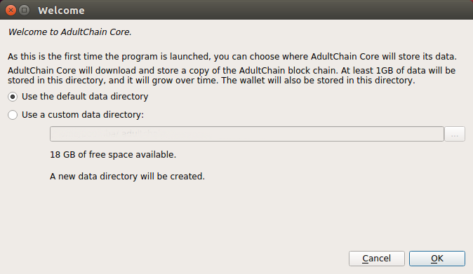
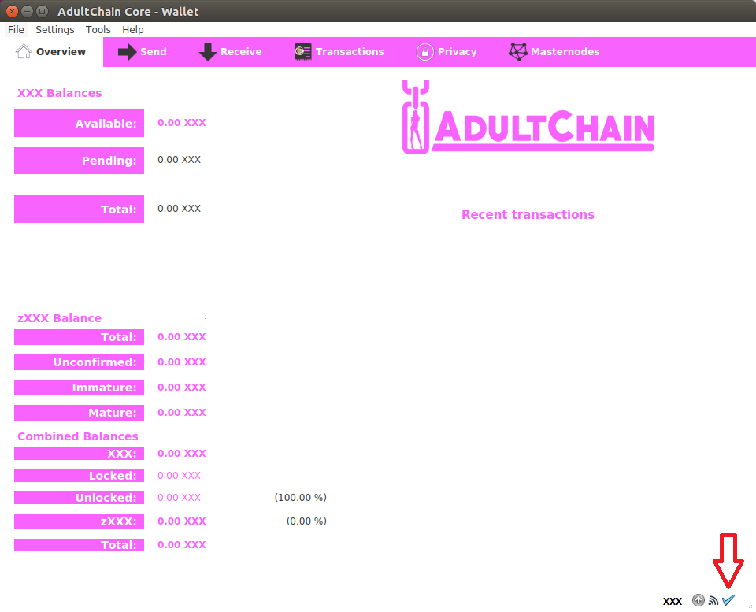

# XXX Linux QT Wallet Install Guide

> This is a community contributed guide. Feel free to suggest improvements via Issues or opening Pull Requests. Thank you!

**!!! This guide is for installing the AdultChain wallet**

---

## Requirements
* Linux Ubuntu 16.04 or higher
* root / sudoer user (member of the sudo group) 
* Basic Linux skills
* Terminal window (CTRL+ALT+T in Ubuntu)
---

## Wallet Setup using the Qt GUI wallet on Linux

### 1. Update your system

#### In a terminal, run:
`sudo apt-get update && sudo apt-get dist-upgrade -y`

### 2. Install and open the AdultChain-Qt wallet on your machine.

#### i.    Download the newest adultchain-qt-ubu64-v1220.zip wallet from [https://github.com/AdultChain/AdultChain/releases](https://github.com/AdultChain/AdultChain/releases)

#### ii.   Extract the adultchain-qt from adultchain-qt-ubu64-v1220.zip

#### iii.  Start the new adultchain-qt

#### iv.   If you get this screen:
 

#### click on "no", then right click on adultchain-qt, go in properties/permission and check "Allow executing file as program"

#### v.    If this is the first time you have started the wallet, you will be asked what folder you want to use to store the date. We recommend you use and note the default folder.

### 3. Let your wallet synchronize (or use bootstrap)
#### vi.  Let the wallet sync until you see this symbol (blue check mark) at the bottom right of your wallet main screen

#### vii. (Optional) If you want your wallet to sync faster, you can download the blockchain bootstrap [here](https://www.dropbox.com/s/ln86e5pk1dc63a7/bootstrap.tar.gz). Close your wallet, then extract the archive with 
`tar -xzvf bootstrap.tar.gz`
#### and put bootstrap.dat in the folder you noted in v. Then just restart your wallet.

### 4. Take extra security steps
#### viii. Encrypt your wallet with a long passphrase and either save it in a password manager such as [keepass](https://keepass.info), or write it down and keep it safe (in a locked compartment or safe) (recommended). This passphrase is your only key to your wallet, do NOT lose it or you will lose all your XXX. Do not let anyone steal your passcode or wallet either, just like in real life!
To encrypt the wallet, go to Settings > Encrypt wallet. Enter the passphrase, click ok. You will then have to restart the wallet and then go to Settings > Unlock Wallet and then enter the passphrase to unlock the wallet, for staking, controlling the masternode or sending your XXX.

#### ix.   Back up your wallet.dat in case of a mistake as soon as you encrypt your wallet. Once you have encrypted the wallet, your previous backups will not work, so back it up by going to File > Backup Wallet and save the backup to more than one place. Such as a USB key or a network share.
