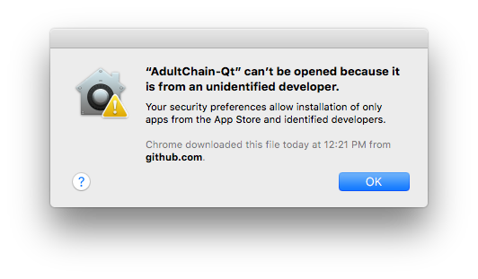
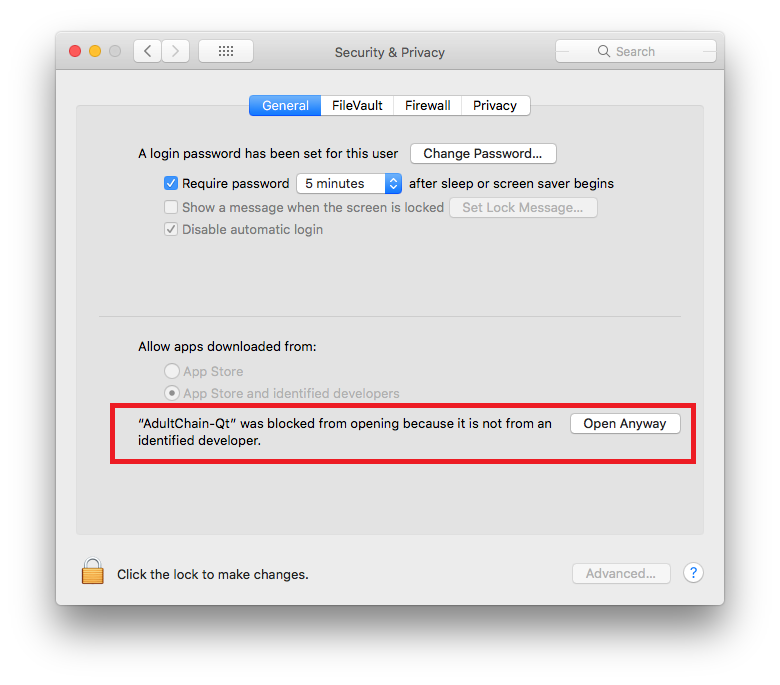
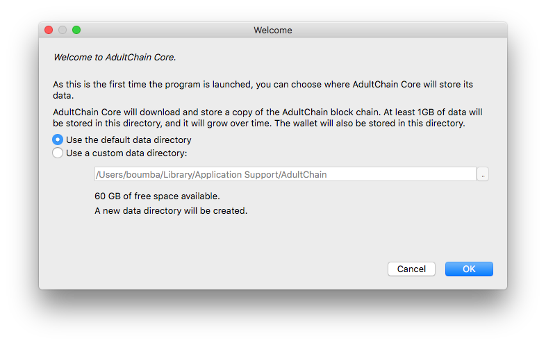
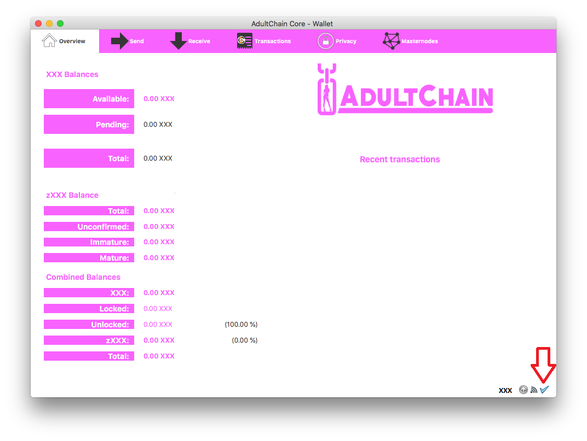

# XXX Mac QT Wallet Install Guide

> This is a community contributed guide. Feel free to suggest improvements via Issues or opening Pull Requests. Thank you!

**!!! This guide is for installing the AdultChain wallet**

---

## Requirements
* OSX 10.12.6
* User with administrative right
---

## Wallet Setup using the Qt GUI wallet on Mac OSX

## 1. Open the AdultChain-Qt wallet on your machine.

#### I.    Download the newest AdultChain-Qt.app-OSX-v1220.zip wallet from [https://github.com/AdultChain/AdultChain/releases](https://github.com/AdultChain/AdultChain/releases)

#### II.   Extract the AdultChain-qt from AdultChain-Qt.app-OSX-v1220.zip

#### III.  Start the new AdultChain-qt

## 2. Enable apps from unknown developper
##### Background:
By default, Mac OSX 10.x.x and macOS only allows users to install or run applications from 'verified sources'. Sometimes, when a known developer (such as Microsoft or PowerSchool) needs to update their application's code to cofirm their "identity" with Apple, an error may occur. As a result, users may be unable to install or run some applications downloaded from the internet or stored on physical media.

#### IV. Open the System Preferences. This can be done by either clicking on the System Preferences icon in the Dock or by going to Apple Menu > System Preferences.

#### V. Open the Security & Privacy pane by clicking Security & Privacy.

#### VI. Make sure that the General section of the the Security & Privacy pane is selected. Then you can click on "Open Anyway".

## 3. Install the wallet

#### VII.    If this is the first time you have started the wallet, you will be asked what folder you want to use to store the date. We recommend you use and note the default folder.

## 4. Let your wallet synchronize (or use bootstrap)
#### VIII.  Let the wallet sync until you see this symbol (blue check mark) at the bottom right of your wallet main screen

#### IX. (Optional) If you want your wallet to sync faster, you can download and install the blockchain files. Click [here](https://gitlab.com/adultchain-project/development/bootstrap/blob/master/Bootstrap_install_guide.md) to have more informations on that method

### 4. Take extra security steps
#### X. Encrypt your wallet with a long passphrase and either save it in a password manager such as [keepass](https://keepass.info), or write it down and keep it safe (in a locked compartment or safe) (recommended). This passphrase is your only key to your wallet, do NOT lose it or you will lose all your XXX. Do not let anyone steal your passcode or wallet either, just like in real life!
To encrypt the wallet, go to Settings > Encrypt wallet. Enter the passphrase, click ok. You will then have to restart the wallet and then go to Settings > Unlock Wallet and then enter the passphrase to unlock the wallet, for staking, controlling the masternode or sending your XXX.

#### XI.   Back up your wallet.dat in case of a mistake as soon as you encrypt your wallet. Once you have encrypted the wallet, your previous backups will not work, so back it up by going to File > Backup Wallet and save the backup to more than one place. Such as a USB key or a network share.
